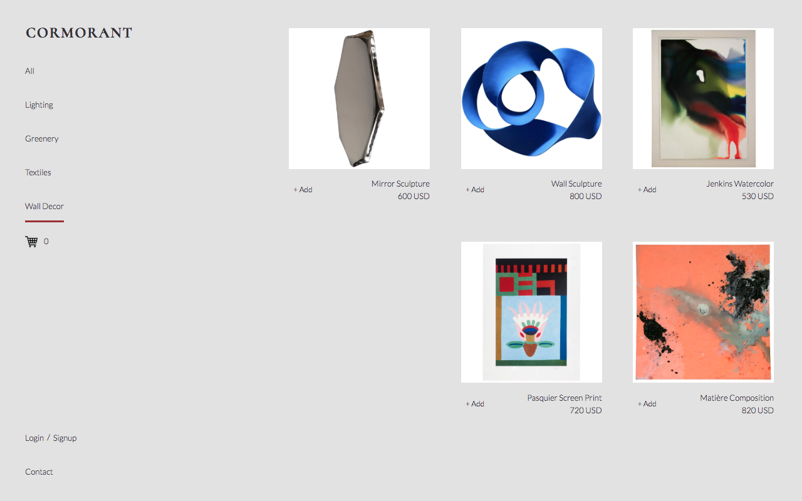

# Grace Shopper

Full-stack JavaScript e-commerce site selling home decor.

## User Story

  - As a customer...
    - I can do a search on all products and see products that match based on name or description.
    - I can add items to cart and can preview number of items in the navigation sidebar.
    - I can quick add to cart from the all products view, or go to a single product's page and add to cart.
    - I can shop as a guest or as a logged-in user.
    - I can choose to have an account by signing in with Google.
    - I can see a cart overview before payment.
    - After a purchase, I see a confirmation that my order was received and my cart is empty again.
    - As a guest...
      - I can choose to create an account. After creating an account, what was in my cart as a guest is still in my cart.
      - I can choose to checkout as a guest, and not create an account.
    - As a user with account...
      - Items added to my cart as a guest will merge with my saved user cart after I login.
      - I can see a user view, in which I can edit my display name in place and see a summary of my past orders.
      - On logout, I am redirected home and cart will become empty until I sign back in.
  - As a administrator...
    - I can go to an admin view to edit product details and edit users.

## Stack

  - React
  - Redux
  - Node Express
  - Sequelize
  - PostgresQL
  - Passport OAuth
  - Stripe
  - Enzyme, Mocha, Chai

## View

Deployed on [http://supermodel-matrices.herokuapp.com/](http://supermodel-matrices.herokuapp.com/)


## Installation

Install JS dev dependencies (listed in [package.json](package.json)):

```bash
npm install
```

Compile with babel/webpack in watch mode and start server:

```bash
npm run start-dev
```

## View

In your browser:

```bash
localhost:3000
```

## Screenshot


## Team

- [Asher Lau](https://github.com/Raire)
- [Cheryl Ng](https://github.com/cherylngql)
- [Jessica Hsu](https://github.com/hsujessica)
